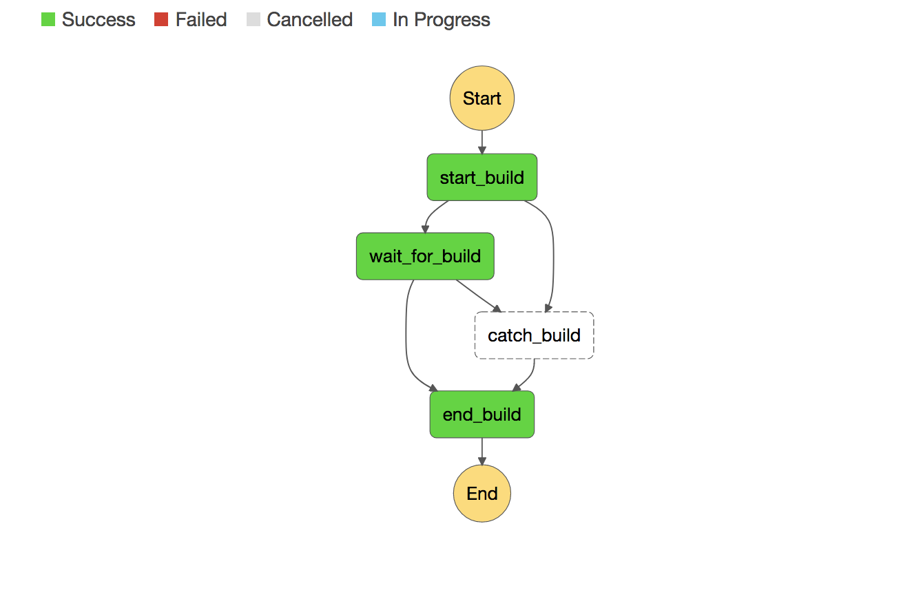

# codebuilder

An AWS CodeBuild project optimized for multiple source repos & any combination of buildspec based scripts from config values. This is achieved by pointing a single CodeBuild project to this projects CI tooling and moving `buildspec.yml` build phases to environment variables.

Inspiration:

- I wanted to be able to execute longer running scripts (lambda limits </3)
- I wanted to [avoid](https://blog.travis-ci.com/2017-05-08-security-advisory) having AWS credentials on third party services
- I also wanted something like deploybot.com, or a chatbot for running one off scripts like publishing npm packages
- I want a cheaper alternative to paid versions of circle/travis ci, and code pipeline didn't work out for me

## AWS Services Overview

- CodeBuild - we'll utilize this service for it's per-minute based pricing <3
- S3 - A single bucket to host the CI tooling scripts that we'll point the CodeBuild project
- Lambda - A single lambda to handle the Step Function State transitions
- Step Function State Machine - Creates a CodeBuild execution, waits for completion, logs completion status



## Getting started

### Provision AWS resources with Terraform

Read through `terraform/main.tf` and update variable names for your environment and remote state s3 bucket.

Create the s3 bucket for terraform remote state:

```
BUCKET=codebuilder-tf npm run tf:create:remote
```

Initialize the terraform state

```
npm run tf:init
```

Run `terraform plan` to see what resources will be provisioned

```
npm run tf:plan
```

If that looks right, run `terraform apply` to creae the resources in AWS

```
npm run tf:apply
```

### Upload CI tooling to S3

Replace bucket name with the bucket created via terraform.

```
BUCKET=codebuilder-tools npm run upload-tools
```

### Deploy Lambda

Replace the placeholder lambda function code that terraform uploaded by deploying the new code with claudia.js.

```
npm run claudia:update
```

### Run an example codebuilder step function

This example will clone, test, build, and deploy a [static react site](https://github.com/eddywashere/sample-create-react-app) to s3.

First create a bucket and configure it for static site hosting. (For convenience I've added those scripts to this project)

```
BUCKET=sample-create-react-app npm run s3:create-bucket
BUCKET=sample-create-react-app npm run s3:configure-bucket
```

Start your first codebuilder state function by running:

```
npm run codebuilder
```

## codebuilder config

The following config variables determine which project and branch to build

```
CI_REPO
# example: CI_REPO=eddywashere/sample-create-react-app

CI_COMMIT
# example: CI_COMMIT=feature-branch
# example: CI_COMMIT=c420de0
```

The following config variables are available to dynamically set your scripts in the CodeBuild execution.

```
CI_SCRIPT_INSTALL
# example: CI_SCRIPT_INSTALL="npm install yarn -g && yarn install --silent"

CI_SCRIPT_PRE_BUILD
# example: CI_SCRIPT_PRE_BUILD="npm run test"

CI_SCRIPT_BUILD
# example: CI_SCRIPT_BUILD="npm run build"

CI_SCRIPT_POST_BUILD
# example: CI_SCRIPT_POST_BUILD="npm run s3:upload"
```

## Working with Secrets

Each project that you'd like to run scripts against should use parameter store to get encrypted secrets.

### Ideas

- Looking into setting up an SNS topic and or github pr status integration
